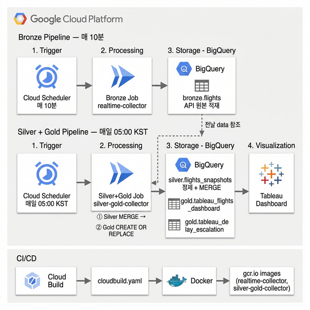
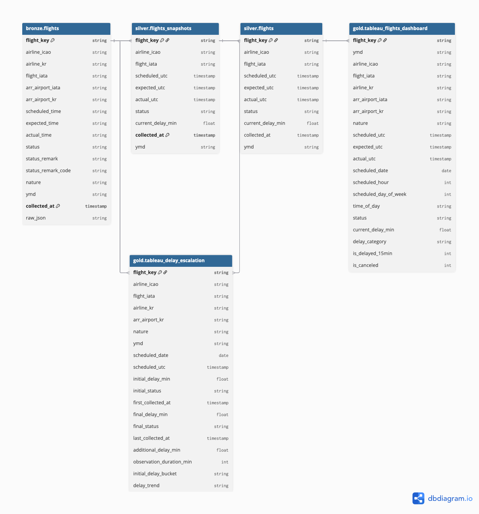

# ✈️ GateReady — 항공편 지연 악화 분석 파이프라인

> **"최초 지연 공지 이후, 지연은 얼마나 더 악화되는가?"**  
> 인천공항 출발 항공편을 10분 간격 스냅샷으로 수집하여, 지연 악화 패턴을 정량화하고 공항·항공사 운영 의사결정에 활용할 수 있는 데이터를 제공하는 파이프라인 프로젝트입니다.

## 목차

- [프로젝트 배경](#프로젝트-배경)
- [프로젝트 목적](#프로젝트-목적)
- [분석 목표](#분석-목표)
- [분석 결과 및 운영 시사점](#분석-결과-및-운영-시사점)
- [기술 스택](#기술-스택)
- [아키텍처](#아키텍처)
- [설계 포인트](#설계-포인트)
- [프로젝트 구조](#프로젝트-구조)
- [환경변수](#환경변수)
- [배포](#배포)
- [한계 및 향후 계획](#한계-및-향후-계획)

## 프로젝트 배경

항공편 지연 시, 승객으로서 최초 공지된 지연 시간보다 실제로 더 오래 기다리게 되는 경험을 반복적으로 했습니다.  
이 개인적 경험에서 출발하여 "지연 공지 이후 추가 지연이 실제로 얼마나 발생하는가"를 데이터로 검증하고자 수집을 시작했고, 분석 결과 **지연 공지 후 73.0%의 항공편이 추가로 악화**된다는 사실을 확인했습니다.

이 데이터는 단순히 승객의 불편을 확인하는 것에 그치지 않고, **공항 운영팀과 항공사의 실질적인 운영 과제**와 직결됩니다:

- 지연 악화를 사전에 인지하지 못하면 **게이트 재배정, 지상 조업 인력 스케줄링**이 후행적으로 이루어짐
- 최초 공지만 제공하는 현행 안내 방식은 승객 불만과 **CS 비용 증가**로 이어짐
- 항공사별 악화 패턴을 모르면 **공항 슬롯 관리와 연결편 보호** 의사결정이 경험에 의존하게 됨

## 프로젝트 목적

이 프로젝트는 매 10분마다 인천공항 출발 항공편 상태를 스냅샷으로 수집하여, **지연이 공지된 이후 실제 출발까지 지연이 어떻게 변화하는지**를 추적합니다.  
이를 통해 지연 악화 패턴을 정량화하고, 공항·항공사 운영팀이 **인력 배치, 게이트 운영, 승객 안내 정책을 개선하기 위한 과거 패턴 분석 근거**를 제공하는 것이 목표입니다.

## 분석 목표

- 지연 최초 공지 시점 → 실제 출발 시각 사이의 **추가 지연(악화) 분포 정량화**
- 항공사별, 시간대별 **지연 악화 패턴** 비교 — 운영 리소스 배분의 근거 마련
- 지연 공지 후 **악화 vs 유지 vs 개선 비율** 산출 — 안내 정책 개선 기초 데이터

## 분석 결과 및 운영 시사점

> 2026년 2월 28일 수집 시작, 3월 18일 기준 인천공항 출발 여객편 **8,909건** 유효 수집

**추가 지연 분석** — 지연 공지 이력이 있고 관측 기간 10분 이상인 **1,536건** 기준:

| 구분          | 지표                                   | 수치       |
| :------------ | :------------------------------------- | :--------- |
| **변화 방향** | 지연 후 **추가 악화**                  | **89.8%**  |
|               | 변동 없음                              | 8.6%       |
|               | 오히려 **개선/단축**                   | 1.6%       |
| **악화 상세** | 전체 중 **15분 이상** 크게 악화된 비중 | **39.8%**  |
|               | 악화 시 **평균 추가 지연 시간**        | **18.2분** |

**핵심 발견**: 지연 공지를 받은 항공편 **10건 중 9건은 결국 더 지연**되며, 악화된 경우 평균 약 18분이 추가됩니다.

### 운영 시사점

| 발견                    | 운영 활용 가능성                                                                   |
| ----------------------- | ---------------------------------------------------------------------------------- |
| 지연 악화율 89.8%       | 최초 지연 공지 시 **추가 지연 가능성을 함께 안내**하여 승객 CS 비용 절감           |
| 15분 이상 악화 39.8%    | 15분 이상 악화가 예상되는 항공편에 대해 **게이트 재배정·지상 조업 일정 선제 조정** |
| 항공사별 악화 패턴 차이 | 악화 빈도가 높은 항공사에 대해 **슬롯 배정 시 버퍼 확보** 또는 운영 협의 근거      |

**항공사별 패턴**: 악화 빈도가 높은 항공사와, 빈도는 낮지만 일단 악화되면 크게 밀리는 항공사로 뚜렷하게 구분되는 경향이 관측됩니다.

## 기술 스택

| 역할     | 기술                          |
| -------- | ----------------------------- |
| 수집     | Python, Requests              |
| 컨테이너 | Docker, Google Cloud Run Jobs |
| 스케줄링 | Google Cloud Scheduler        |
| 저장소   | Google BigQuery               |
| CI/CD    | Google Cloud Build            |
| 시각화   | Tableau                       |

## 아키텍처



### 레이어 구조

| 레이어     | 테이블                           | 갱신 주기  | 설명                                                    |
| ---------- | -------------------------------- | ---------- | ------------------------------------------------------- |
| **Bronze** | `bronze.flights`                 | 매 10분    | API 원본 그대로 적재. 수집 시각(±3시간 윈도우)별 스냅샷 |
| **Silver** | `silver.flights_snapshots`       | 매일 05:00 | 상태 변화가 있는 스냅샷만 필터링 + 이상 시간값 정제     |
| **Gold**   | `gold.tableau_flights_dashboard` | 매일 05:00 | 항공편별 최신 운항 현황 (Tableau 연결)                  |
| **Gold**   | `gold.tableau_delay_escalation`  | 매일 05:00 | 항공편별 최초→최종 지연 변화 분석 (Tableau 연결)        |

### ERD



## 설계 포인트

### 수집 윈도우 설계 및 개선

매 실행마다 현재 시각 기준 일정 범위의 항공편을 조회합니다.  
단순히 "지금 시각의 항공편"만 보면, 지연된 항공편의 이력 변화를 충분히 추적할 수 없기 때문입니다.

**초기 설계**: 현재 시각 `±3시간` (예정 출발 기준)

**문제 발견**: 수집된 데이터를 분석한 결과, 지연이 3시간을 초과하는 항공편은 예정 출발 시각이 수집 윈도우 밖으로 밀려나 최종 출발 시각이 누락되는 현상을 확인했습니다.  
2026년 3월 10일 기준, 전체 수집 데이터의 8.9%(475건)에서 `actual_utc`가 `NULL`로 기록되었고, 이 중 96%(457건)가 지연 항공편이었습니다.

**개선**: 현재는 **과거 5시간 / 미래 3시간** 비대칭 윈도우로 변경.  
미래 방향 확장은 의미가 없고(아직 상태 변화가 없는 항공편), 과거 방향을 넓혀 장기 지연 항공편을 더 오래 추적합니다.

### Silver 레이어의 MERGE 전략

Silver 적재 시 단순 `WRITE_APPEND`가 아닌 **staging 테이블 → MERGE** 방식을 사용합니다.  
동일 `(flight_key, collected_at)` 조합이 중복으로 들어오는 것을 방지하여 멱등성을 확보합니다.

### Silver + Gold 통합 Job

Silver와 Gold를 별도 Job으로 분리하지 않고 **단일 Cloud Run Job(`silver-gold-job`)** 으로 통합했습니다.  
Silver 처리가 완료된 뒤 Gold를 실행하는 순서 보장이 필요하고, 두 작업 모두 하루 1회 실행이라 오케스트레이션 레이어(Cloud Workflows)를 별도로 두는 것이 과도한 복잡성을 추가한다고 판단했습니다.  
Silver 실패 시 Gold 실행을 중단(`raise SystemExit(1)`)하여 불완전한 Gold 데이터 생성을 방지합니다.

### 이상 시간값 처리

API 응답에 `"13:68"`, `"91:2"` 같은 시간 형식이 혼재합니다.  
공항 시스템 내부의 포맷 불일치로 추정되며, 이를 숫자로만 받아 직접 파싱하는 `clean_flight_time()` 로직을 구현했습니다.

## 프로젝트 구조

```
GateReady/
├── cloud_run/
│   ├── Dockerfile              # Bronze Job 이미지 (realtime-job)
│   ├── Dockerfile.silver_gold  # Silver+Gold 통합 Job 이미지 (silver-gold-job)
│   ├── run_job.py              # Bronze Job 엔트리포인트
│   └── run_silver_gold_job.py  # Silver+Gold Job 엔트리포인트
├── src/
│   ├── collectors/
│   │   ├── bronze.py           # API 수집 + BigQuery 적재
│   │   ├── realtime.py         # 실시간 수집 (±3시간 윈도우)
│   │   ├── silver.py           # Bronze 정제 + MERGE
│   │   └── gold.py             # Silver 기반 Gold 테이블 갱신
│   ├── bq.py                   # BigQuery 클라이언트 공통 모듈
│   ├── config.py               # 환경변수 기반 설정
│   └── logger.py               # 로깅 설정
├── sql/
│   ├── bronze/                 # Bronze 테이블 정의 DDL
│   ├── silver/                 # Silver 테이블 정의 DDL
│   └── gold/
│       ├── create_tableau_dashboard_table.sql   # Gold: 최신 운항 현황
│       └── create_delay_escalation_table.sql    # Gold: 지연 변화 분석
├── cloudbuild.yaml             # Cloud Build CI/CD (Bronze + Silver+Gold 이미지)
└── .env.example                # 환경변수 예시
```

## 환경변수

`.env.example`을 참고하여 `.env` 파일을 생성합니다. 배포 및 로컬 실행을 위해 먼저 설정되어야 합니다.

| 변수명                           | 설명                                    |
| -------------------------------- | --------------------------------------- |
| `BQ_PROJECT_ID`                  | GCP 프로젝트 ID                         |
| `BQ_DATASET_BRONZE`              | Bronze 데이터셋 이름 (기본값: `bronze`) |
| `BQ_DATASET_SILVER`              | Silver 데이터셋 이름 (기본값: `silver`) |
| `BQ_DATASET_GOLD`                | Gold 데이터셋 이름 (기본값: `gold`)     |
| `FLIGHT_API_URL`                 | 인천공항 항공편 API 엔드포인트          |
| `AIRLINE_API_URL`                | 항공사 정보 API 엔드포인트              |
| `GOOGLE_APPLICATION_CREDENTIALS` | GCP 서비스 계정 키 경로                 |

## 배포

```bash
# 전체 빌드 및 배포 (Bronze 이미지 + Silver+Gold 이미지)
gcloud builds submit --config cloudbuild.yaml --project=$PROJECT_ID .
```

Cloud Build는 다음 두 이미지를 빌드하고 Cloud Run Job을 업데이트합니다:

| 이미지                                     | Cloud Run Job     | 트리거                           |
| ------------------------------------------ | ----------------- | -------------------------------- |
| `gcr.io/$PROJECT_ID/realtime-collector`    | `realtime-job`    | Cloud Scheduler (매 10분)        |
| `gcr.io/$PROJECT_ID/silver-gold-collector` | `silver-gold-job` | Cloud Scheduler (매일 05:00 KST) |

## 한계 및 향후 계획

### 수집 윈도우와 장기 지연 항공편

수집 윈도우는 **예정 출발 시각 기준 과거 5시간 ~ 미래 3시간**입니다.  
지연이 5시간을 초과하는 극단적 케이스는 윈도우 밖으로 벗어나 최종 출발 시각이 누락될 수 있습니다.

**개선 방향**: 미출발 지연 항공편 목록을 BigQuery에서 조회하여 항상 수집 대상에 포함하는 watchlist 기반 수집 로직 도입 예정

### 향후 확장 방향

- **지연 악화 예측 모델**: 축적된 스냅샷 데이터를 기반으로 최초 지연 공지 시점에 추가 악화 여부와 예상 추가 지연 시간을 예측하는 ML 모델 개발
- **실시간 알림 시스템**: 악화 확률이 높은 항공편에 대해 운영팀이 선제 대응할 수 있도록 Slack/이메일 알림 연동
- **표본 확대 및 검증**: 현재 약 13일 간 174건의 지연 항공편 기준 분석으로 계절성·요일별 패턴 검증을 위해 장기 수집 지속
